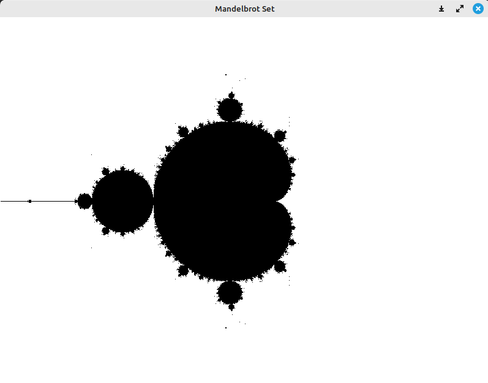
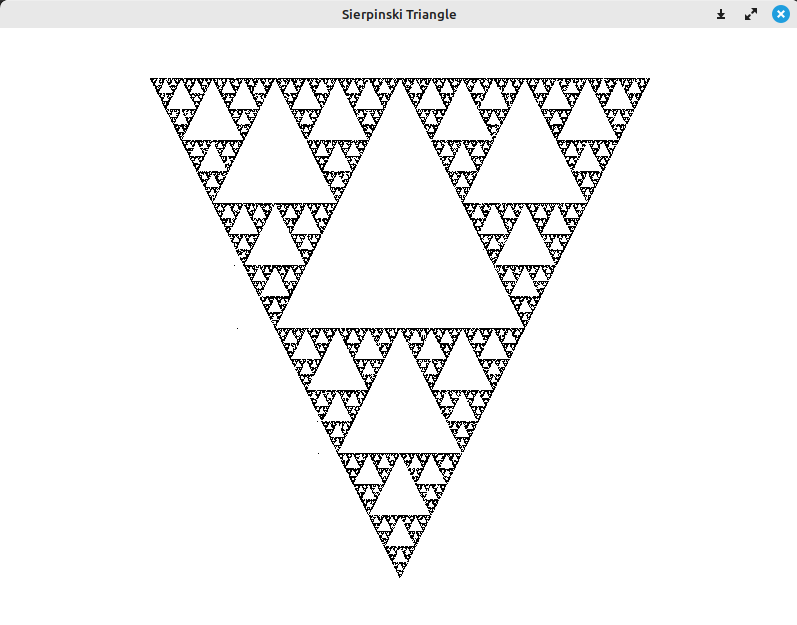

# Примеры фракталов: множество Мандельброта и треугольник Серпинского

Репозиторий содержит примеры рисования **множества Мандельброта** и **треугольника Серпинского**
с использованием библиотеки `libX11`.

## Сборка

1. Клонируйте репозиторий

```bash
git clone https://github.com/AlexEr92/fractal_examples.git
cd fractal_examples/
```

2. Установка зависимостей

```bash
sudo apt install cmake libx11-dev
```

3. Сборка проекта

```bash
mkdir build/ && cd build/
cmake ..
cmake --build .
```

## Запуск и результаты

Множество Мандельброта:

```bash
./mandelbrot
```


Треугольник Серпинского:

```bash
./sierpinski
```

